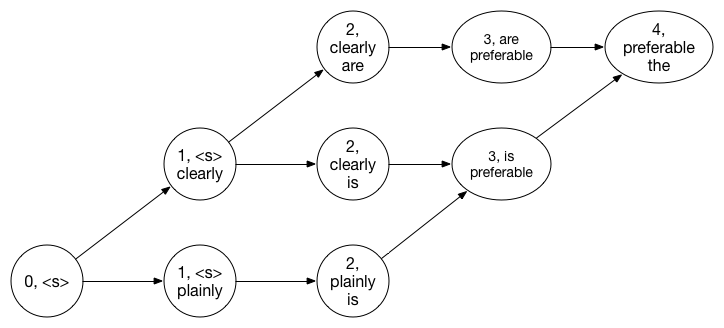
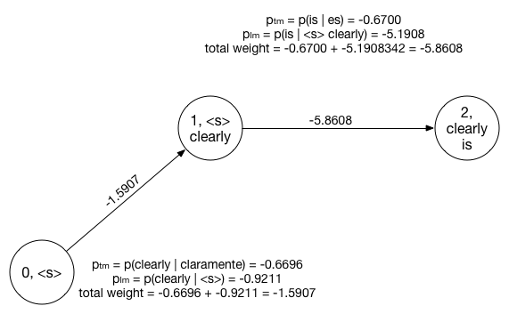

# Decoding for Machine Translation

Decoding is the problem of taking an input sentence in a foreign language:

<i>claramente , es preferible la segunda opción</i>

 

and finding the best translation into a target language, according to a model:

<i>clearly , the second option is preferable</i>

 

**Your task is to implement a simple decoder, which attempts to find the most probable translation, given the Spanish input, the phrase-based translation likelihood model, and the English language model.** We assume the traditional noisy channel decomposition:
$$\begin{align\*}
\textbf{e}^* &= \arg \max_{\textbf{e}} p(\textbf{e} \mid \textbf{f}) \\\\
 &= \arg \max_{\textbf{e}} \frac{p_{\textrm{TM}}(\textbf{f} \mid \textbf{e}) \times p_{\textrm{LM}}(\textbf{e})}{p(\textbf{f})} \\\\
 &= \arg \max_{\textbf{e}} p_{\textrm{TM}}(\textbf{f} \mid \textbf{e}) \times p_{\textrm{LM}}(\textbf{e}) \\\\
 &= \arg \max_{\textbf{e}} \sum_{\textbf{a}} p_{\textrm{TM}}(\textbf{f} \mid \textbf{a},\textbf{e}) \times p_{\textrm{AM}}(\textbf{a} \mid \textbf{e}) \times p_{\textrm{LM}}(\textbf{e}) \\\\
 &\approx \arg \max_{\textbf{e}} \max_{\textbf{a}} p_{\textrm{TM}}(\textbf{f} \mid \textbf{a},\textbf{e}) \times p_{\textrm{LM}}(\textbf{e})
\end{align\*}
$$
We make the additional assumption that the distribution over all segmentations and all alignments (AM) is *uniform*. This means that there is **no** distortion model or segmentation model. You will not be evaluated on translation quality, BLEU score, or human correlation, but simply on how well you execute the above search. Do not be surprised if you see cases where qualitatively better translations are assigned a lower probability than a qualitatively worse translation—the language model and translation models we are providing are imperfect!

## Getting started

To get started with this lab, download the required data and code <a href="mtlab.tgz">tarball</a> or <a href="mtlab.zip">zip file</a>.
We have provided you with a simple greedy word-base decoder written in Python, along with a 3-gram English language model, an English–Spanish
phrase-based translation model, and some Spanish input sentences.

You can try running the included decoder by running the following command.

    python decode.py > output.txt

Take a look at the generated output and you will notice that while some of the right words appear the translation quality is rather poor.
We can quantify this using the included `grade.py` script by using the command:

    cat output.txt | python grade.py

The grading script returns two numbers. The first is a score, which represents the log probability of your 55 generated English sentences given the 55 Spanish sentences. The second is the number of sentences that were unable to be decoded (see below). The default decoder&apos;s output should score $-11501.120463$ and $4$ respectively.

The simple decoder solves the search problem, but makes several major assumptions:

1. It assumes that each Spanish word translates independently of the rest of the input sentence decisions. This means that the decoder fails to capture language phenomena such as words with multiple meanings, subject-verb agreement, or any sort of idiomatic usage.
2. It does not do any reordering of words in the target language. Therefore it is unable, for example, to correctly switch the order of the noun-adjective pairs in the Spanish input sentences.
3. Finally, some words in the input sentences do not have simple one-to-one translations in the provided model, yet they may be translatable as part of larger phrases. The provided decoder will fail to produce output on such sentences at all!

Your tasks will be to modify the provided code to address these shortcomings.

## Step 1 -- Incorporating a language model

We can improve the translation quality of this simple decoder by using a language model to ensure fluency of the output English sentence.
This has the additional effect of indirectly allowing input Spanish words to influence the translation of other nearby words. However, this makes the decoding problem much more complicated.

One way to accomplish language model integration is by running the Viterbi algorithm (or any shortest path algorithm of your choosing) on a carefully crafted graph structure described below.
Each state in the graph is labeled by a tuple $(i, c)$, where $i$ is the number of words translated so far and $c$ is the state of the language model, and itself
a tuple representing the last (up to) two words of the English translation. The initial state is thus $(0, (\text{&quot;&lt;s&gt;&quot;}))$.

<figure>

<figcaption>Figure 1 &mdash; An example translation graph</figcaption>
</figure>

Edges are added by looking up each source word $s_i$ ($i \in \[0, N\]$ where $N$ is the number of words in the source sentence) in the translation table.
For each translation $e_j$ of $s_i$ add an arc from each state $(i, c)$ to $(i + 1, c')$, where $c'$ is the last two words of the string $c$ concatenated with $e_j$. Note that while we assume at this stage that we will be translating one word at a time, $e_j$
may consist of more than one word! The weight of each arc will be the sum of log probability from the translation model and the log probability from the language model.

<figure>

<figcaption>Figure 2 &mdash; Computation of edge weights</figcaption>
</figure>

In addition, we will add one extra pseudo-word &quot;&lt;/s&gt;&quot; to the end of our input sentence, and a corresponding final state to the end of the graph.
Thus the final state of the graph will be $(N + 1, c_{end})$ where $c_end$ is a tuple that ends with &quot;&lt;/s&gt;&quot;, and each
state $(N, c)$ will transition to $(N + 1, c_{end})$. Since &quot;&lt;/s&gt;&quot; always translates itself, the log translation probability for these
final edges will be zero, so their total weight will be $0 + \log p_{\textrm{LM}}(\text{&lt;/s&gt;} \mid c)$.

## Step 2 -- Translating entire phrases
Now we will seek to generalize our <i>word-to-word</i> translator with a <i>phrase-to-phrase</i> one. Modify the graph you built to encorporate phrase translations as follows.
Look up each span $s_{i:j}$ in the translation table. For each of the possible translations, add an arc from each state $(i, c)$ to the state $(j, c')$ with the appropriate
edge weight.

## Step 3 -- Local Reordering
Next, expand your decoder to allow for the swapping of adjacent phrase pairs. To do this, modify your graph states so instead of simply storing how many words have been translated so far, they instead store a <i>coverage vector</i> $v$ &mdash; an array of booleans with the same length of the input sentence such that $v_i$ is true if the $i$th word has been translated and false if the $i$th word has yet to be translated. Now when adding edges to your graph, before adding an arc that covers input span $\[i,j)$, first check that $v_{i:j}$ is all false &mdash; that is to say that all the word in the span $\[i,j)$ have not yet been translated.

## Step 4 -- Global reordering
In the previous step you implemented a decoder that allowed phrase pairs to move one &quot;slot&quot; to the right or left. Now consider what happens if we allow phrases to move two slots in either direction. How about three? Four? $n$? We call the maximum distance a phrase can move the <i>distortion limit</i>. As the disortion limit grows, the complexity of the tanslation graph grows factorially. To ensure that we still get translations in a reasonable time, many decoders use <i>beam search</i> to find the most likely translations.

The most common implementation of beam search for machine translation is a <i>stack-based</i> decoding algorithm that works by incrementally building up hypothesis translations from left to right.
Begin in the initial state as above, and explore all possible translations of a single phrase.
Group the translations by the number of source words translated.
(Each of these groups is called a &quot;stack&quot;, hence stack-based decoding).
From each stack, discard all but the $k$ top-scoring hypotheses, where $k \in \mathbb{Z}$ is a parameter that controls the speed-accuracy tradeoff.
Next, for each hypothesis in the &quot;one source word covered&quot; stack, repeat the procedure, considering all possible expansions of each of the (up to) $k$ items in that stack.
Again, group hypotheses by number of source words, prune to the top $k$, then procede to the &quot;two words covered&quot; stack.
Continue this procedure until you&squot;ve examined the $N$th stack where $N$ is the length of the input sentence, and return the best-scoring hypothesis from that stack. 

This approach is the fundamental design that underpins modern machine translation decoders, such as moses.

## Submitting your output
 * You may upload your best output at any time by visiting the <a href="upload.html">Submit Output</a> page.
 * Your group&apos;s score will be shown on the <a href="leaderboard.html">leaderboard</a> under your team pseudonym.
 * Uploaded output is graded approximately once a minute, so please allow some time after uploading.

## Acknowledgements

This assignment has been done in the past in the course developed by [Adam Lopez, Chris Callison-Burch, and Matt Post](http://mt-class.org/hw2.html).
